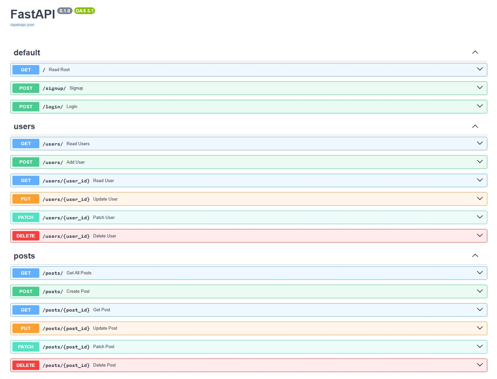
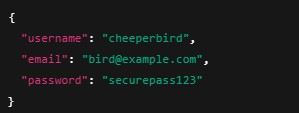
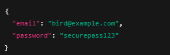
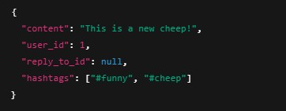
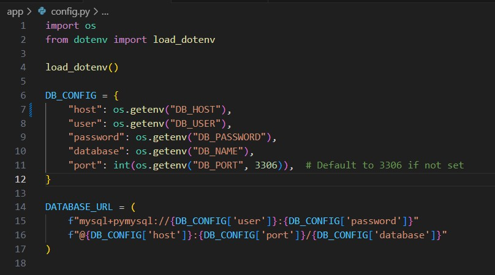
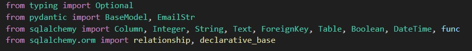
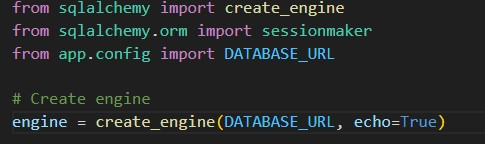

# IDG2001 - Report on Assignment 1
## Basic information
* Task: Create a Social Media Service, "Twitter from Temu", e.g. a more basic version of the popular social media.
* Title: Cheeper [another bird sound, also sounds like "cheaper" which fits.]
* Group: Kaja, Jon, Stian

## Idea
We wanted to create a social networking service inspired by the older version of Twitter (now X). We brainstormed for a suitable name and ended up with the name "Cheeper", a pun for the bird sounds of "cheep cheep" much like twitter's pun on "tweet tweet".

## Technologies chosen
### fastAPI
We decided to go for fastAPI as web-framework for the API serving the back-end functionality of the application. fastAPI is known for fast performance, being modular and light weight, greatly supports asyncronous programming and ORMS like SQLAlchemy.

#### Endpoints
GET / — Read Root: Shows a message: "Server is running"

POST /signup/ — Signup: Handles signups from front end through an authorization route

POST /login/ — Login: Authenticates a user logging in through an authorization route

---

GET /users/ — Read Users: Retrieves a list of users.

POST /users/ — Add User: Adds a new user.

GET /users/{user_id} — Read User: Retrieves data for a specific user by ID.

PUT /users/{user_id} — Update User: Fully updates a specific user (replace all data).

PATCH /users/{user_id} — Patch User: Partially updates a user (e.g., just a name or email).

DELETE /users/{user_id} — Delete User: Deletes a user.

---

GET /posts/ — Get All Posts: Retrieves all posts.

POST /posts/ — Create Post: Adds a new post.

GET /posts/{post_id} — Get Post: Retrieves a specific post by ID.

PUT /posts/{post_id} — Update Post: Fully updates a specific post.

PATCH /posts/{post_id} — Patch Post: Partially updates a post.

DELETE /posts/{post_id} — Delete Post: Removes a post.

#### Models
Request body for signup:

* All fields required
* Email must be valid email format (EmailStr)
* Password is hashed server side
---

Request body for login:

* Requests returned as JSON
---

Request body for create post:

### mySQL hosted on Clever Cloud
We decided to use mySQL as a relational database hosted on Clever Cloud (a free PaaS).
Cheeper has their own organization page on the service with each developer accessing the databse through seperate logins.

#### Database credentials
Each developer has database credentials saved in an .env for local testing, and stored with dotenv for security purposes, but db credentials are also stored in Render for server deployment.

#### SQLAlchemy
We decided to implement the use of SQLAlchemy in our API to ensure cleaner code and more secure queries. This allows for python code, instead of having to write raw SQL queries.

SQLAlchemy also simplifies database access by establishing a database connection through a create_engine function that provides connection with the database.

### Render
The API server is deployed on Render on https://idg2001-o1-social-networking-service.onrender.com/. This supports zero downtime deployment and automatic deployment when new pushes occur in deployment directory.

### Frontend
We used a simple, yet modern design for our frontend using HTML, SCSS/CSS and JavaScript. We were inspired by the old design and colors of how Twitter (now X) used to look like. To symbolize our social network name "cheeper", the logo represents an outline of a Sparrow, as Sparrows' sounds are similar to "cheep cheep".

The reasoning for SCSS is that this is a mixed group in terms of subjects taken,
so SCSS was a little more advanced than basic CSS, while still not being as advanced as React/Vue.
Thus it was a good compromise between simple to implement and the modern frontend-setups.

We also implemented the option of using the app in dark mode for those with a low-light preference, represented by a sun/mood button the the nav-bar.

## Features
### Post-rendering (feed)
Posts are rendered continuously on the main page, and you may view them
whether logged in or not. These posts/this feed is the bread and butter of the site.
These posts can be interacted with further (if logged in), see features below.

### Navigation bar
For navigating between the main page/feed, login/signup and user pages.
Also eventually more stuff in the future.

### Users
A user may sign up and create a user with name, email and password. They may also log in,
and they get some visual feedback and a welcome message to showcase this status.
This login (session) is stored in localStorage.

### User authorization
We decided to implement password hashing by using bcrypt for user safety and to prevent cyber attacks.
Bcrypt is a good option as it uses salts and won't allow identical hashes for identical passwords,
as well as it being intentionally slow to prevent brute force and rainbow attacks.
It is also widely supported and a trusted in the devolopment security community.

### Posts and reply posts
A logged in user may create a post, and also reply to other posts.
If replying, a posts is linked to another posts by that post's ID.
This also gives the opportunity to display them in relation to the other post.

### Likes
A logged in user may like an individual posts, and individual likes are tracked
and stored in the DB.

### Hashtags
Posts may have attached hashtags, to sort them into categories.

### Caching
Local caching is provided using localStorage to ensure some offline functionality,
but primarily to improve loading speed as it won't always be necessary fetching data from the backend.
This utilizes a separate script imported into the main frontend-script.

### Error logging
Should there be errors they are sometimes provided to the users for common user errors,
while others are logged in console to ease future work for developers/maintainers.
