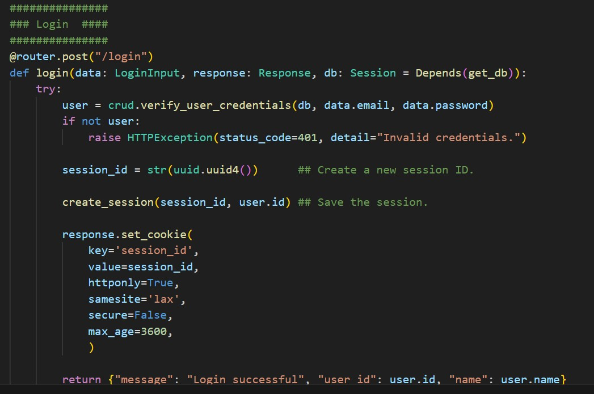

# IDG2001 - Report on Assignment 2

## Basic information
* Task: Improve the Social Media Service, "Twitter from Temu", into a "First Price Twitter".
* Title: Cheeper
* Group: Kaja, Jon, Stian

## Summary
Cheeper 2.0 is an upgraded version of our previous social media prototype from assigment 1. In this iteration, we focused on transforming it into a scalable, performant, and feature-rich microblogging platform. Key highlights include Docker-based deployment, Redis caching, session management, and new interactive user features such as likes batching, hashtag tracking, and post replies.

## Technology Stack:
* Backend: Python (FastAPI), Redis, MySQL (hosted via Clever Cloud)
* Frontend: HTML, CSS, JavaScript
* Containerization: Docker, Docker Compose
* Logging: Custom logger with endpoint /get/logs

## New API additions

### Hosting 
We decided to move our development server over to Docker for easier development and testing. 

#### Running project with Docker (local server) 
1. Make sure an .env with database credentials are included in the root of the project directory
2. Run "docker compose up --build" in terminal
3. Run Visual Studio Code Live Server of "index.html"

### Session management with cookies
User authentication is managed through session cookies, implemented in auth_routes.py. When a user logs in, a session cookie is created; it is deleted upon logout. An /auth/me route is used to verify the current session and ensure authentication for protected operations such as creating, editing, liking, and deleting posts.

### Caching
Caching provided with Redis, an in-memory store used in our architecture to support fast data access and caching. Redis runs as a separate Docker container using the redis:alpine image. Backend services (web-1 and web-2) connect to Redis by referencing the Redis service hostname (redis) defined in Docker Compose. Response time is improved as Redis caches frequently accessed data, which also benefits the backend load.

### Logger
Logs of calls to the API end points can be accessed via endpoint /get/logs. These custom logs provide information on request method, path, status code and timestamp in running order from time of server startup.

## New features

### Reply to posts
Posts can now be replied to by other users. Replies are stored as new posts but has a relationship with the post being replied to.

### Login/Profile Toggle
When session cookie is created and user is authenticated "Login" changes into user's profile link.

### Edit/Delete Post
Users can edit and delete posts in their profile where username, email and user's posts are displayed.

### Like posts (with batcher)
While liking of posts was already implemented in Assignment 1, they were not fully functioning. In this second iteration functionality is fully implemented with a like posts batcher. To prevent unecesary load on the database as the app potentially grows in popularity and posts are liked in larger numbers within a short timeframe likes are now sent to the database every 10 likes or after 1 minute, instead of for every like.

### Hashtags 
Hashtags are identified and extracted from post text and saved to database. They can be searched for in the nav-bar search feature.

### Search Bar
In this iteration of Cheeper the search bar is fully functional. User is able to search for content in posts, user accounts created on the site and hashtags used in published posts.

## Future Work

* Implement load balancer
* Improve search functionalitylink accounts to public profiles
    * Link accounts to public user profiles
    * Hashtags found in posts
    * Full post functionality in search results
* Fully implement account following in both backend and frontend

