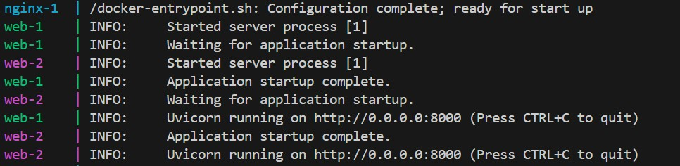
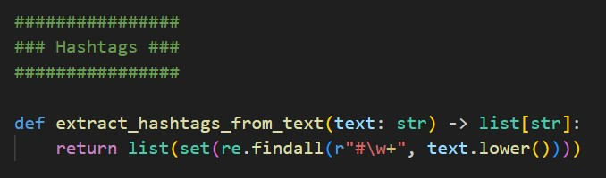
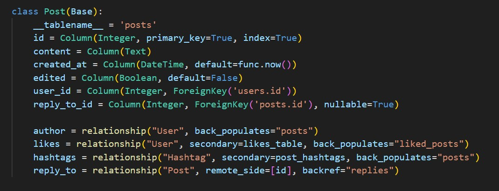
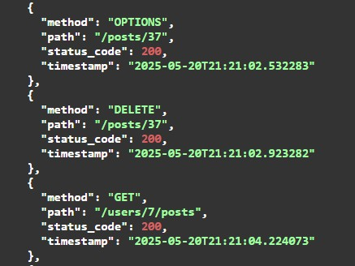

# IDG2001 - Report on Assignment 2
## Basic information
* Task: Improve the Social Media Service, "Twitter from Temu", into a "First Price Twitter".
* Title: Cheeper [another bird sound, also sounds like "cheaper" which fits.]
* Group: Kaja, Jon, Stian

## New technologies
### Docker 
We decided to move our development server over to Docker for easier development and testing. 

#### Running project with Docker (local server) 
1. Make sure an .env with database credentials are included in the root of the project directory
2. Run "docker compose up --build" in terminal
3. Run Visual Stuio Code Live Server of "index.html"

### Load Balancer
To balance the load in the backend, our service uses NGINX to distribute load across multiple Docker containers (web-1 and web-2). This has several benefits to our service. Security and abstraction is improved as clients communicate with NGINX instead of communicating with backend containers or Redis. And if one backend instance fails NGINX traffics the routing traffic to the other container(s).

#### Running Docker with NGINX
1. To run development with NGINX balancer run "docker-compose up --scale web=2 --build" in terminal instead of "docker compose up --build"

### Caching
Caching provided with Redis, an in-memory store used in our architecture to support fast data access and caching. Redis runs as a seperate container with Docker (redis:alpine). Backend services (web-1 and web-2) connect to Redis by referencing the Redis service hostname (redis) defined in Docker Compose. Response time is improved as Redis caches frequently accessed data, which also benefits the backend load.

## New features
### Like posts batcher
While like posts was already implemented in assignment 1, they were not fully functioning. In this second iteration like posts is fully implements with like posts batcher. To prevent uneccesary load on the database likes are sent to database every 1000 likes or after 1 minute ??????

### Hashtags 
Hashtags are identified and extracted from post text and saved to database. They can be searched for in the nav-bar search feature.

### Reply to posts
Posts can now be replied to by other users. Replies are stored as new posts but has a relationship with the post being replied to.

### Login/Profile Toggle
When session cookie is created and user is authenticated "Login" changes into user's profile link.

### Edit/Delete Post
Users can edit and delete posts in their profile where username, email and user's posts are displayed.

### Search Bar
In this iteration of Cheeper the search bar is fully functional. User is able to search for content in posts, user accounts and hashtags used in posts.

### Logger
Logs of calls to the API end points can be accessed via endpoint get/logs and will give information on request method, path, status code and timestamp.

